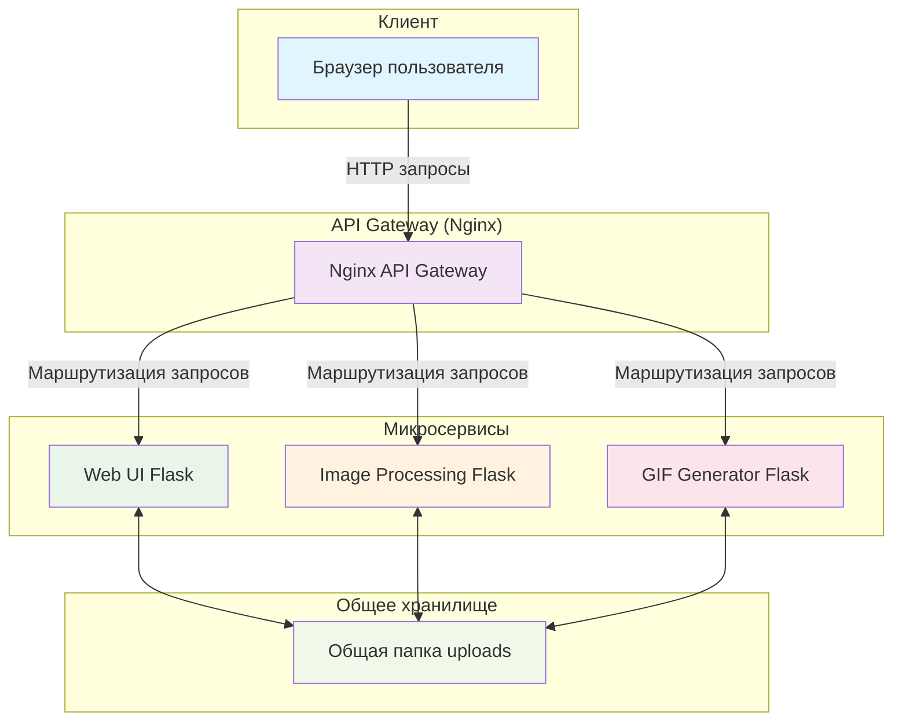
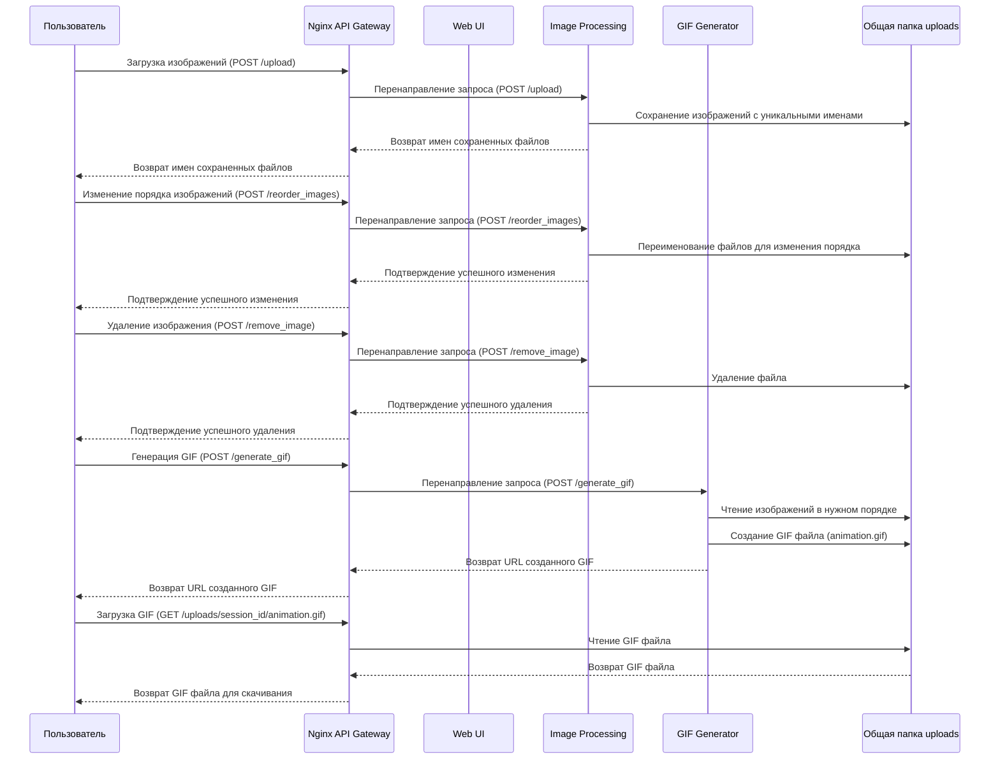

# Схема архитектуры приложения "Генератор GIF"

## Общая архитектура

## Подробная схема прохождения данных от загруженной картинки до скачиваемого GIF

## Архитектурные особенности

### 1. Микросервисная архитектура
- **Web UI**: Обрабатывает интерфейс пользователя, управляет сессиями
- **Image Processing**: Обрабатывает загрузку, удаление и переупорядочивание изображений
- **GIF Generator**: Генерирует анимированные GIF из изображений
- **Nginx API Gateway**: Централизованная точка входа, маршрутизация запросов

### 2. Управление сессиями
- Каждый пользователь получает уникальный `session_id`
- Все файлы хранятся в отдельной подпапке, названной по `session_id`
- При создании новой сессии старые файлы удаляются

### 3. Путь прохождения данных:

#### Загрузка изображения:
1. Пользователь выбирает изображения в браузере
2. Запрос отправляется на `/upload` через Nginx
3. Nginx перенаправляет запрос в Image Processing сервис
4. Изображения сохраняются в папку `/uploads/{session_id}/` с уникальными именами
5. Возвращается список новых имен файлов

#### Обработка изображений:
1. Пользователь может изменить порядок изображений
2. Запрос `/reorder_images` перенаправляется в Image Processing
3. Файлы переименовываются с префиксами для сохранения порядка

#### Генерация GIF:
1. Пользователь нажимает "Создать GIF"
2. Запрос `/generate_gif` перенаправляется в GIF Generator
3. Сервис читает изображения в нужном порядке из папки сессии
4. Создается анимированный GIF с заданными параметрами
5. Файл сохраняется как `animation.gif` в той же папке

#### Скачивание GIF:
1. Пользователь нажимает "Скачать GIF"
2. Запрос на получение файла `/uploads/{session_id}/animation.gif`
3. Nginx возвращает файл из общей папки